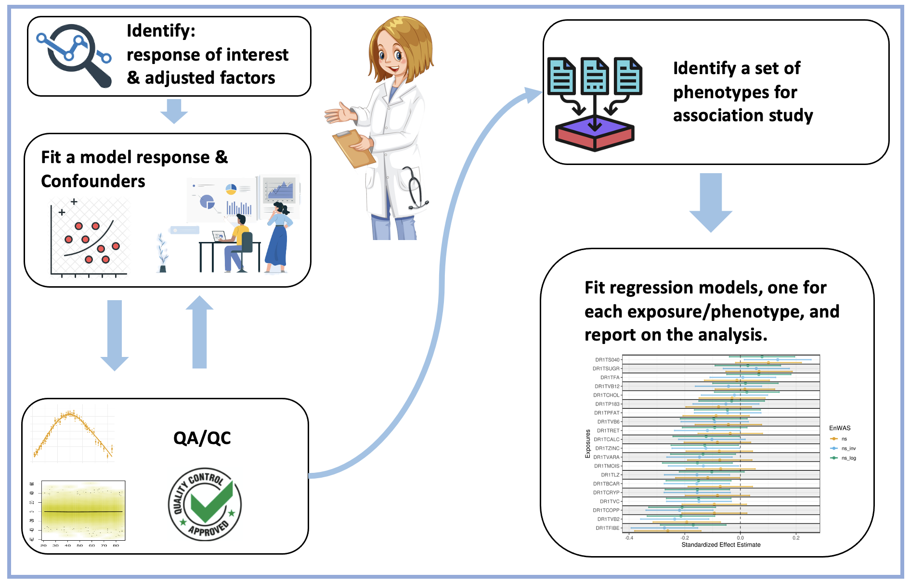

```{r, include = FALSE}
knitr::opts_chunk$set(
  collapse = TRUE,
  comment = "#>"
)
```

# Objective

This notebook demonstrates an Environment‐Wide Association Study (EnWAS) work flow shown in Figure \@ref(fig:workflow). 

```{r workflow, fig.cap = "EnWAS Work Flow",fig.align = 'center',out.width = '90%',echo=FALSE}

```
The issue we want to address is the following.  Given an outcome, say diastolic blood pressure, we want to explore a set of phenotypes, say nutrition variables, to see which, if any are associated with changes in blood pressure.  We also know that there are a number of physical and other characteristics that might be confounders: ie they are known to associate with both difference in blood pressure and with choices in foods.

Some key confounders are listed in Table \ref{tab:riskfactors}

\begin{table}
\centering
\begin{tabular}{l|r|r|r|r}
\hline
Variable  & Association\\
\hline
Age & Increases with age \\
\hline
Sex &	Men tend to have higher BP until women pass menopause \\
\hline
Race &	Black/African American individuals often have higher BP \\
\hline
Body Mass Index (BMI) & Strong positive association
\hline
Socioeconomic Status (SES) &	Lower SES is linked with higher BP \\
\hline
Education level &	Lower education is associated with higher BP\\
\hline
\end{tabular}
\caption{Demographic Risk Factors for Blood Pressure}
\label{tab:riskfactors}
\end{table}

In this example, we are interested in finding nutrition phenotypes that associate with diastolic blood pressure. We first set up our base model that includes a set of confounders we want to adjust for. We then perform some QA/QC steps to ensure that the base model is reasonable, and once that has been done we then will perform the EnWAS. 


# Identify a response and a set of confounders that will be adjusted for

## Identify The Data Source

We will use the [NHANES](https://www.cdc.gov/nchs/nhanes/index.htm) as our data source more details about data can be found on the CDC website. 

## Identify a response, or outcome of interest.
In this demonstration, we choose diastolic [blood pressure](https://wwwn.cdc.gov/Nchs/Nhanes/2015-2016/BPX_I.htm#BPXDI1) as the outcome interest. 

For each survey a number of people were chosen to provide blood pressure measurements and these were obtained in duplicate on two separate days.
To get an more accurate measurement of the diastolic blood pressure, we average two times of measurements for each participants.

## Identify a set of confounders that will be adjusted for.  These are typically not of interest themselves, but are important established confounders such as age or sex that should be adjusted for.

Based on our literature review we feel that sex, age, ethnicity, education and BMI are likely to affect blood pressure, and we choose them as the confounders to adjust for.  In a more realistic analysis we would likely also want to find out who is taking medications that are intended to alter blood pressure, but for simplicity of the exposition we will ignore
that issue in this analysis.

Normally the model fitting and QA/QC process would be carried out in an exploratory and iterative fashion, however that is not easy to capture in a static document.  Instead we will compare two basic models, one where we assume that there is a straight line relationship between continuous confounders and our response, and a second approach where we use spline 
models.  This approach has some similarities to the Generalized Additive Model (GAMs) and much of the literature there is useful. There are some differences though, and we will outline them as we go.


```{r setup,warning=FALSE,message=FALSE, echo=F}
library(PheWAS)
library(splines)
library(ggplot2)
library(ggpubr)
library(dplyr)
library(DBI)
library(nhanesA)
library(DT)
library(kableExtra)

```


## Load data that contains responses and confounders, and preprocess using PHONTO 

We load the NHANES data using functions from [PHONTO package](https://github.com/ccb-hms/phonto). The PHONTO package provides a set function to facilitate researchers to get access NHANES data in our docker database.  More detail about data query and search tools can be found on [quick start page](https://ccb-hms.github.io/Imputation/6_phonto/quick_start.html).
In addition, the `phesant()` function allows the user to check the data inspired by the [PHESANT package](https://github.com/MRCIEU/PHESANT).

RG wants to also look at SES, so it has been added.  Also for now just cut this down to one epoch (_I).
```{r phonto}
cols = list(DEMO_I=c("RIDAGEYR","RIAGENDR","RIDRETH1","DMDEDUC2","INDFMPIR"), 
            BPX_I=c('BPXDI1','BPXDI2',"BPXSY1","BPXSY2"),
            BPQ_I=c('BPQ050A','BPQ040A', 'BPQ020','BPQ080','BPQ100D'),
            BMX_I="BMXBMI"
            )
base_df <- jointQuery(cols)
phs_res = phesant(base_df)
phs_res$phs_res |> kbl(caption = "PHESANT-like Process Results",align='c') |>
  kable_classic(full_width = T, html_font = "Cambria")
```
Table \@ref(tab:phonto) shows variables names, the ratio of unique values (`r_unique`), the proportion of zeros (`r_zeros`), and the ratio of NAs (`r_NAs`), which is calculated by the number of unique values, zeros, and NAs divided by total records. The categorical data types (ordered or unrecorded) are presented by integers, and the PHESANT function category them as multilevel. The data are categorized as continuous (doubles, integers) and multilevel(characters, integers with unique values less than 20), as shown type column. For example, education (DMDEDUC2) is category as Multilevel(8) means the PHESANT process considers it multilevel and has 8 levels; moreover, `r_NAs` shows that almost 50% of education data is missing, and we recommend users check data in the cases like this. `r_zeros` shows that about 0.8% blood pressure measurements are filled as 0s. We may want to remove those data records because blood pressure with 0s is for dead people.

We remove missing values (shown with NAs in R data frame) and blood pressure filled with 0s, which indicates.
In the NHANES database gender(`RIAGENDR`) encode as 1 for male and 2 for female. Similarly, ethnicity (`RIDRETH1`) are also encode as integers (1 to 5); We need to convert those as variables as factors.

```{r}
# remove age under 20 and diastolic with 0s
base_df = base_df |> subset(RIDAGEYR>20 & BPXDI1!=0 & BPXDI2!=0 )
# assign the gender and ethnicity to the real levels
#base_df = phonto::nhanesTranslate('DEMO_I', c('RIAGENDR', 'RIDRETH1'), data=base_df)
# Transform education to:
#  < High School
#   - High School
#  > High School

nDEDUC = base_df$DMDEDUC2
nDEDUC[nDEDUC == "Don't Know"] = NA
nDEDUC = factor(nDEDUC)
levels(nDEDUC) = c("<HS", ">HS", "HS", "<HS", ">HS")

base_df$DMDEDUC2 <- nDEDUC

# Take average first and second read for the diastolic blood pressure. -
# taking some care to use a value if one is present
base_df$DIASTOLIC <- rowMeans(base_df[, c("BPXDI1", "BPXDI2")], na.rm=TRUE)
base_df$DIASTOLIC[is.na(base_df$BPXDI1) & is.na(base_df$BPXDI2)] = NA
base_df$SYSTOLIC <- rowMeans(base_df[, c("BPXSY1", "BPXSY2")], na.rm=TRUE)
base_df$SYSTOLIC[is.na(base_df$BPXSY1) & is.na(base_df$BPXSY2)] = NA
#the variables BPQ050A and BPQ040A are taken conditionally so they have missing values put in
# for anyone who answered no to BPQ020 - and we need to fix that - since their answer to 50A 
# had they been asked, would have been no (one presumes)
#set up a dummy for the ones we want to change - also turn "Don't know" from BPQ020 into NA
# The current study included 6866 US adults aged 40 years or older. 
hypertensiveMeds = base_df$BPQ050A
hypertensiveMeds = ifelse(base_df$BPQ020=="No", "No", hypertensiveMeds)
base_df$hypertensiveMeds = hypertensiveMeds
base_df$hypertension <- base_df$DIASTOLIC >= 90 | base_df$SYSTOLIC >= 140 |  base_df$hypertensiveMeds=="Yes"
base_df$unControlledHypertension = base_df$DIASTOLIC >= 90 | base_df$SYSTOLIC >= 140
```

Perhaps try to study the univariate relationship between DIASTOLIC (SYSTOLIC?) and some of the features.
```{r EDA}
  ##make_bins seems to need some help dealing with missing
 
  plot_bins(x="DIASTOLIC",y="INDFMPIR", data=base_df, title="Diastolic vs Poverty")
  boxplot(base_df$INDFMPIR~base_df$hypertensiveMeds)
         
```
# Build Baseline Model

To find plausible models, we should build models and perform QA/QC process iteratively. In the following demonstrations, we built a linear regression model and another linear model with apply natural spline function on the continuous variables. The outcome is diastolic is the average of the diastolic first (`BPXDI1`) and second (`BPXDI2`) reads, gender(`RIAGENDR`), age (`RIDAGEYR`), ethnicity (`RIDRETH1`), BMI(`BMXBMI`) and education(`DMDEDUC2`).


```{r build_base_model,echo=TRUE,results = "asis"}
sub_df = base_df[,c("RIDAGEYR", "RIAGENDR", "BMXBMI", "RIDRETH1", "DMDEDUC2", "INDFMPIR", "hypertensiveMeds",
                    "DIASTOLIC", "SYSTOLIC")]
sub_df=sub_df[complete.cases(sub_df),]

##probably drop Diastolic as we really don't model it well multiple R^2 is 2%
####lm_base <- lm(formula = lm_str, data=sub_df)
##ns_str <-
##  'DIASTOLIC ~ ns(RIDAGEYR, df=7) + RIAGENDR + 
##      BMXBMI + RIDRETH1'
##ns_base <- lm(formula = as.formula(ns_str), data = sub_df)

lmS_str <- 'SYSTOLIC ~ RIDAGEYR + RIAGENDR + BMXBMI + RIDRETH1+ INDFMPIR + hypertensiveMeds'
lmS_base <- lm(formula = lmS_str, data=sub_df)
nsS_str <-
  'SYSTOLIC ~ ns(RIDAGEYR, df=7) + RIAGENDR + 
      invNorm(BMXBMI) + RIDRETH1+ bs(INDFMPIR, df=5) + hypertensiveMeds'
nsS_base <- lm(formula = as.formula(nsS_str), data = sub_df)

##no strong evidence that the spline is better than linear for INDFMPIR
nsS_str2 <- 'SYSTOLIC ~ ns(RIDAGEYR, df=7) + RIAGENDR + 
      BMXBMI + RIDRETH1+ bs(INDFMPIR, df=5) + hypertensiveMeds'
ns_Ssm = lm(formula = as.formula(nsS_str2), data=sub_df)
anova(ns_Ssm, nsS_base)
```


# QA/QC for Base Model

We need to check the base model and ensure it runs correctly before performing EnWAS. However, the classical methods such as Q-Q plots, residual plots, and goodness of fit (GoF) tests are generally ill-suited. We want to provide the following plots to demonstrate the criteria of QA/QC. 

It is clear to see that the diastolic blood pressure has a parabola-like shape relation with the age, as shown in Figure \@ref(fig:age). The yellow and blue lines are generated by smooth prediction from linear and spline models. The dots are randomly sampled in 20% of the data points.


```{r,age, fig.cap = "Linear vs Spline", fig.align = 'center',echo=FALSE, eval=FALSE}

pred_df <- data.frame("Age"=base_df$RIDAGEYR, 
                      "Gender"=base_df$RIAGENDR,
                      "BMI"=base_df$BMXBMI,
                      "DIASTOLIC" = base_df$DIASTOLIC,
                      "Linear"=lm_base$fitted.values,
                      "Spline"=ns_base$fitted.values)
mpred_df <- reshape::melt(pred_df, id=c("DIASTOLIC","Age","Gender",'BMI'))
base_raw_g <- ggplot(mpred_df,
         aes(
           x = Age,
           y = DIASTOLIC
         )) +
  geom_point(data = ~ group_by(.x, Age, Gender,BMI) |> sample_frac(0.2),
             alpha = 0.2, shape=1) +
  geom_smooth(aes(x = Age,y=value,colour=variable),size=1.5,
              method='lm',formula=y ~ splines::ns(x,df=7)
              )+
  xlab("Age (year)")+ylab("Diastolic (mmHg)")+ facet_grid(cols = vars(variable))+
   scale_colour_manual(name="Model", values=c("#E69F00", "#56B4E9"))+
  theme_minimal()+theme(legend.position = "none")
base_raw_g
```


## Residuals vs. Covarites and Fitted Values

The transnational methods cannot detect the linear model fit data poorly.

We can check the residuals against the fitted value with a smooth scatter plot. And we find that there are no apparent trends for both models, even though the spline model has fewer mean square errors.


A possible solution to check the "goodness of fit (GoF)" is to check whether apparent trends in the plots of residual against terms in the models. We can spot a slight trend residual in the BMI range from 20 to 40, indicating that using linear regression on BMI term may not hurt the model performance too much. However, a strong parabola-like trend can be observed in the residuals of the linear model with respect to ages, which indicates that the linear model cannot capture age. In other words, the model is not good enough to be a base model to run EnWAS; the findings are more likely false positives if using such a base model. On the other hand, the residuals spline model has no clear trends with respect to both BMI and age, which means the base model captures the relations of outcomes (diastolic) and the known confounders.

We can further check the base models with binned plots, which can be helpful when the data set is large. The binned plot is a way that "zoom in" to look at the trends.


```{r binned33, results = "asis",warning=FALSE,echo=FALSE, eval=FALSE}
##for at least age and poverty the residuals look a lot better
df_age_res <- list("Linear"=make_bins(x=sub_df$RIDAGEYR,y=lmS_base$residual,nbin=100),
                "Spline"=make_bins(x=sub_df$RIDAGEYR,y=nsS_base$residuals,nbin=100)
                )
age_res <- plot_bins2(df_age_res,xlab="Age (year)",ylab="Binned Residuals") + ylim(-8,6.5)+theme(legend.position = "none")

df_bmi_res <- list(Linear = make_bins(x=sqrt(sub_df$BMXBMI), y=lmS_base$residual, nbin=100),
                   Spline = make_bins(x=sqrt(sub_df$BMXBMI), y=nsS_base$residuals,nbin = 100))
bmi_res = plot_bins2(df_bmi_res, xlab="sqr(BMI)", ylab="Binned Residuals")

df_ind_res = list(Linear = make_bins(x=sub_df$INDFMPIR, y=lmS_base$residual, nbin=200),
                 Spline = make_bins(x=sub_df$INDFMPIR, y=nsS_base$residual, nbin=200))
ind_res = plot_bins2(df_ind_res, xlab="INDFMPIR", ylab="Binned Residuals")

}


xasdaf

```{r, eval=FALSE}
##stopped here
pred_df <- data.frame("Age"=base_df$RIDAGEYR, "Gender"=base_df$RIAGENDR, "BMI"=base_df$BMXBMI,"DIASTOLIC" = base_df$DIASTOLIC,"Linear"=lm_base$residuals,"Spline"=ns_base$residuals)
mpred_df <- reshape::melt(pred_df, id=c("DIASTOLIC","Age","Gender",'BMI'))
res_g <- ggplot(
    mpred_df, aes(x = Age, y = value)) +
    stat_density2d(aes(fill = ..density..^0.25), 
                   geom = "tile", contour = FALSE, n = 200) +  
  geom_smooth(aes(x = Age,y=value,colour=variable),
              size=1.5,method='lm',formula=y ~ splines::ns(x,df=7))+
  facet_grid(cols = vars(variable))+scale_colour_manual(name="Model", values=c("#E69F00", "#56B4E9"))+
    viridis::scale_fill_viridis(guide="none",option = "A",alpha = 0.6) +
  ylab("Residuals")+ xlab("Age(year)")+
  theme_minimal() +theme(legend.position = "none")
tmp_df <- data.frame(Fitted_Value = c(lm_base$fitted.values,ns_base$fitted.values),
                     Residuals = c(lm_base$residuals,ns_base$residuals),
                     model = c(rep("Linear",nrow(base_df)),rep("Spline",nrow(base_df)))
                     )
fitt_g <- ggplot(tmp_df, aes(x = Fitted_Value, y = Residuals)) +
    stat_density2d(aes(fill = ..density..^0.25),
                   geom = "tile", contour = FALSE, n = 200) +
  geom_smooth(aes(x = Fitted_Value, y = Residuals,colour=model),
              size=1.5,method='lm',formula=y ~ splines::ns(x,df=7))+
  facet_grid(cols = vars(model))+
  scale_colour_manual(name="Model", values=c("#E69F00", "#56B4E9"))+
  xlab("Fitted Values")+
    scale_fill_viridis_c(alpha = 0.6,guide = "none") + theme_minimal()+theme(legend.position = "none")
```

Figure \@ref(fig:qaac) shows QA/QC plots.

- **_a)_**  Smooth scatter plots for residuals with respect to fitted values, and there is no strong pattern in both cases even though the spline has less mean square error than the linear model.
- **_b)_**  Smooth scatter plots for residuals with respect to age variable,  and the linear model has a parabola-like pattern, whereas no obvious pattern for the spline model.
- **_c)_** Binned plots for residuals with respect to age variable to look at the trends of residuals against age.


```{r qaac, eval=FALSE, fig.cap = "Quality Assurance and Quality Control",fig.align = 'center',fig.width = 10,fig.height=8,echo=FALSE}
ggpubr::ggarrange(fitt_g,res_g,age_res,nrow = 3,ncol = 1,labels = c('a)','b)','c)'))
```


# Identify a set of phenotypes and exposures 

Identify a set of phenotypes and exposures that we want to test for association with the response variable of interest.
In this example, we choose phenotype from the dietary data, we identified the phenotypes and saved them into a built-in variable call `exposure_vars` in EnWAS package. "The objective of the dietary interview component is to obtain detailed dietary intake information from NHANES participants. The dietary intake data are used to estimate the types and amounts of foods and beverages (including all types of water) consumed during the 24-hour period prior to the interview (midnight to midnight), and to estimate intakes of energy, nutrients, and other food components from those foods and beverages." More detail can be found [code book](https://wwwn.cdc.gov/Nchs/Nhanes/2015-2016/DR1TOT_I.htm). 

```{r, eval=FALSE}
exposure_vars = c("DRQSPREP","DR1TNUMF" ,"DR1TKCAL" ,"DR1TPROT", "DR1TCARB", "DR1TSUGR", "DR1TFIBE", "DR1TTFAT", "DR1TSFAT" ,"DR1TMFAT" ,"DR1TPFAT", "DR1TCHOL" ,
                  "DR1TATOC" ,"DR1TRET"  ,"DR1TVARA" ,"DR1TBCAR" ,"DR1TCRYP" ,"DR1TLZ"  , "DR1TVB1" , "DR1TVB2" , "DR1TNIAC", "DR1TVB6" , "DR1TFOLA", "DR1TFA",  
                  "DR1TFF", "DR1TFDFE", "DR1TVB12" ,"DR1TVC","DR1TVK" ,"DR1TCALC", "DR1TPHOS" ,"DR1TMAGN", "DR1TIRON", "DR1TZINC", "DR1TCOPP", "DR1TSODI",
                  "DR1TPOTA" ,"DR1TSELE" ,"DR1TMOIS", "DR1TS040","DR1TS080", "DR1TS120", "DR1TS160", "DR1TS180" ,"DR1TM161", "DR1TM181", "DR1TM201", "DR1TP183",
                  "DR1TP204")
diet_data = unionQuery('DR1TOT',exposure_vars)
dim(diet_data)
```
Once we load the dietary data, we should also check it with the PHESANT function and preprocess it if necessary.
We may need to eplore the missing data for the above data according to [the notebook](https://ccb-hms.github.io/Imputation/6_phonto/missing_exploratory.html). Currently, we only keep the columns that has less missing rate less than 15%. The observations with missing values in the covariates in the baseline model or current phenotype will be remove during EnWAS.


## Transformation
In NHANES, the phenotypes are often right-skewed with a very long tail on the right side of the distribution, which can be addressed with logarithm transformation followed by a z-transformation. However, it would take a tremendous effort to manually and exhaustively inspect the distributions and figure out appropriate transformation methods for all kinds of phenotypes with different types of distribution when dealing with extensive data sets. Therefore, we recommend using inverse normal transformation (INT) for all continuous variables because INT can apply various distributions. We compared the EnWAS results of logarithm transformation followed by a z-transformation with normal inverse transformation. 

Figure \@ref(fig:DR1TTFAT) shows an example of Total fat (DR1TTFAT) with non transformation, log-z transformation, and inverse normal transformation.


```{r DR1TTFAT, eval=FALSE, fig.cap = "Transformation for Total fat (gm)",fig.align = 'center',out.width = '85%',fig.height=4,echo=FALSE}
plot_trans <- function(x){
  layout(matrix(c(1,2,3), ncol=3, byrow=TRUE))
  par(mar=c(4.0,4.0,3.5,1))
  x <- na.omit(x)
  hist(x,main = "none")
  log(x+1e-5) |> scale() |> hist(main="log-Z")
  invNorm(x) |> hist(main="INVT")  
}
plot_trans(diet_data$DR1TTFAT)
```

# Carry out a set of regression models.
In this step, we need to carry out a set of regression models, one for each exposure/phenotype in Step 5, and report on the analysis.

```{r, eval=FALSE}
data = merge(base_df,diet_data,by = "SEQN")
data = na.omit(data)
xwas = enwas(ns_str,exposure_vars,data)
xwas_log <- enwas(ns_str,exposure_vars,data,trans = "log")
xwas_inv <- enwas(ns_str,exposure_vars,data,trans = "inv")
```

Figure \@ref(fig:enwas00forest) shows the estimates and CI of the exposure variables and only displays the top 10 (if they have more than 30 satisfy the filters) ranked by absolute values of the estimates. The variables with their CI containing zeros are also removed.

```{r enwas00forest, eval=FALSE, fig.cap = "Forest Plot for non tranformation EnWAS", fig.align = 'center',warning=F, out.width = '85%',dpi = 200}
forest_plot(xwas$enwas_res,10) # filter out CI contains 0
```


Figure \@ref(fig:enwasinv1log)  shows the top 10 exposures, ranked by the differences in the estimates for the same variables.
- `ns` denotes the variables non-transformed, but the estimates  with beta^hat * SD(X)
- `ns_inv` denotes variables transformed inverse normal transformation
- `ns-log` denotes variables transformed with log followed by z-transformation

```{r enwasinv1log, eval=FALSE, fig.cap = "Multiple Forest Plots", fig.align = 'center',echo=F,warning=F, out.width = '90%',dpi = 200}
forest_plot_mult(list(ns=xwas$enwas_res,ns_inv=xwas_inv$enwas_res,ns_log=xwas_log$enwas_res),10)
```

The following scatter plot shows the inverse normal transformation estimates against estimates (beta^hat * SD(X)) of nontransformed variables. The top 20 has added text for the variables, but it is pretty clear to show the information.

```{r enwas_inv22, eval=FALSE, echo=F,warning=F, echo=F,out.width = '90%',fig.align = 'center',out.width = '85%'}
ns=xwas$enwas_res
ns_inv=xwas_inv$enwas_res
ns_log=xwas_log$enwas_res
enwas_res = data.frame(x=ns$estimate,
                       x_upper = ns$upper,
                       x_lower = ns$lower,
                       y=ns_inv$estimate,
                       y_upper=ns_inv$upper,
                       y_lower=ns_inv$lower,
                       z=ns_log$estimate,
                       z_upper=ns_log$upper,
                       z_lower=ns_log$lower,
                       diff1 = abs(ns_inv$estimate-ns$estimate),
                       diff2 = abs(ns_log$estimate-ns$estimate),
                       diff3 = abs(ns_log$estimate-ns_inv$estimate),
                       term = ns_inv$term
                       )
```


Figure \@ref(fig:enwasinv230) estimates of EnWAS  non-transformed (`EnWAS`) with inverse normal transformation (`EnWAS INT`). The the top 20 most difference variables label with variable names.

```{r enwasinv230, eval=FALSE, fig.cap = "Scatter Plot for EnWAS against EnWAS with INT", warning=FALSE,echo=F,fig.align = 'center', out.width = '90%',dpi = 200}
library(ggrepel)
top_n_diff <- 10
enwas_res |>
ggplot(aes(x,y,label = term,colour=term)) +
  geom_point(size=1.5)+
  geom_smooth(aes(x,y,colour=NULL),method = "lm", formula = y~x)+
  geom_text_repel(data=dplyr::top_n(enwas_res,top_n_diff,diff1),aes(label=term))+
  theme_minimal()+
  theme(legend.position = "none")+xlab("EnWAS") + ylab("EnWAS INT")
```


We can also compare the non-transformed with log-z transformation, and log-z transformation with inverse normal transformation.

